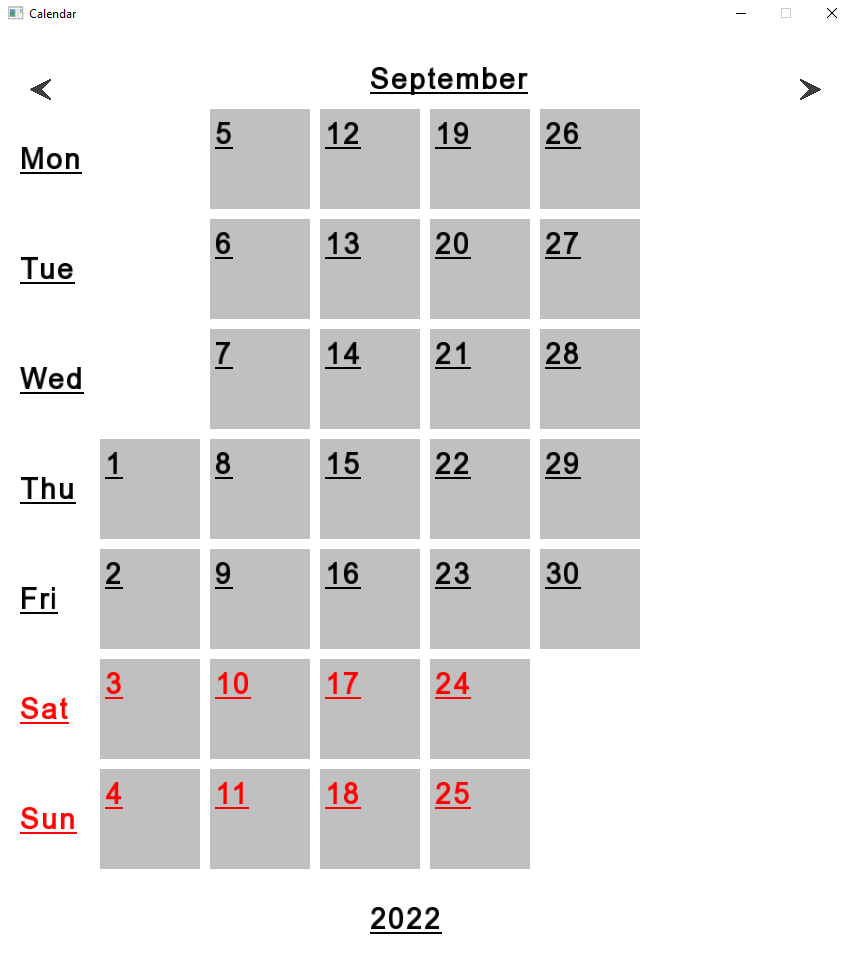
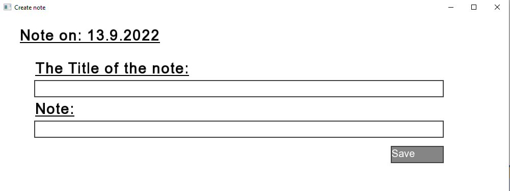
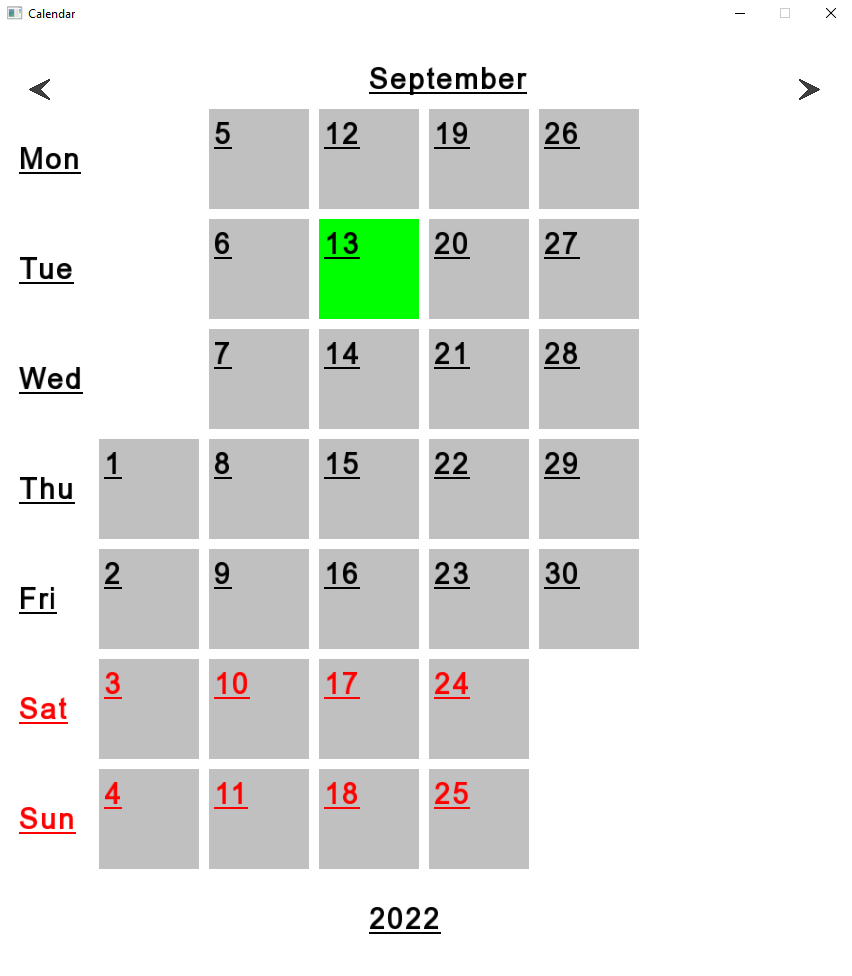
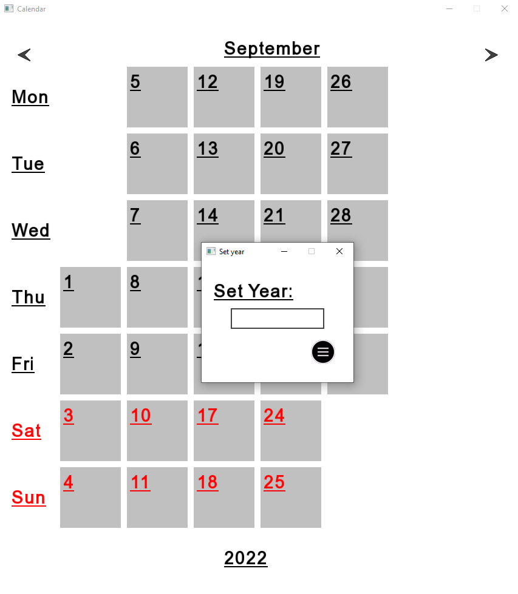

# CalendarSFML

The calendar is written using the SFML graphics library. In it, you can choose the year you want to watch. You can also create several notes for any date. Such dates will be marked in green in the calendar.

Main screen

Make note screen

Note date screen

Select year screen

